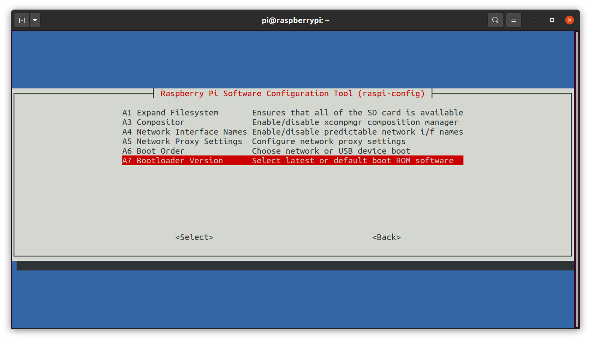
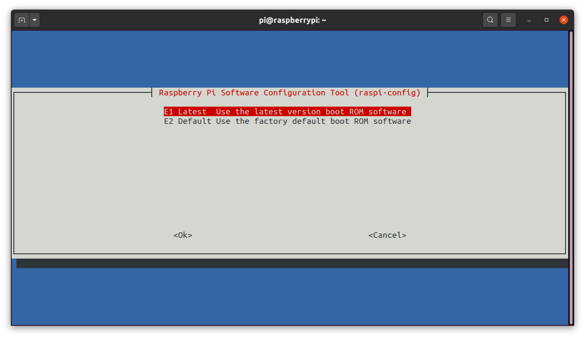
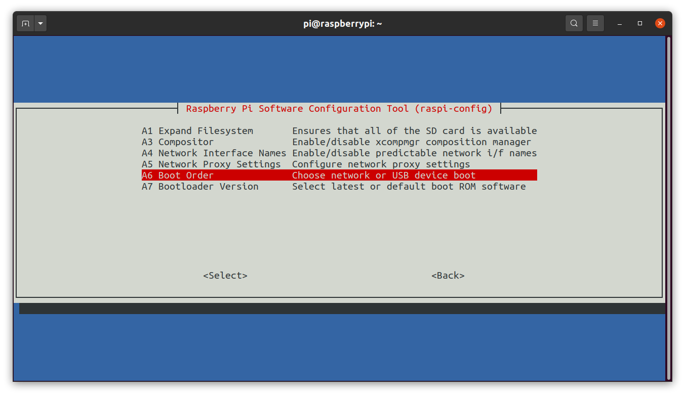
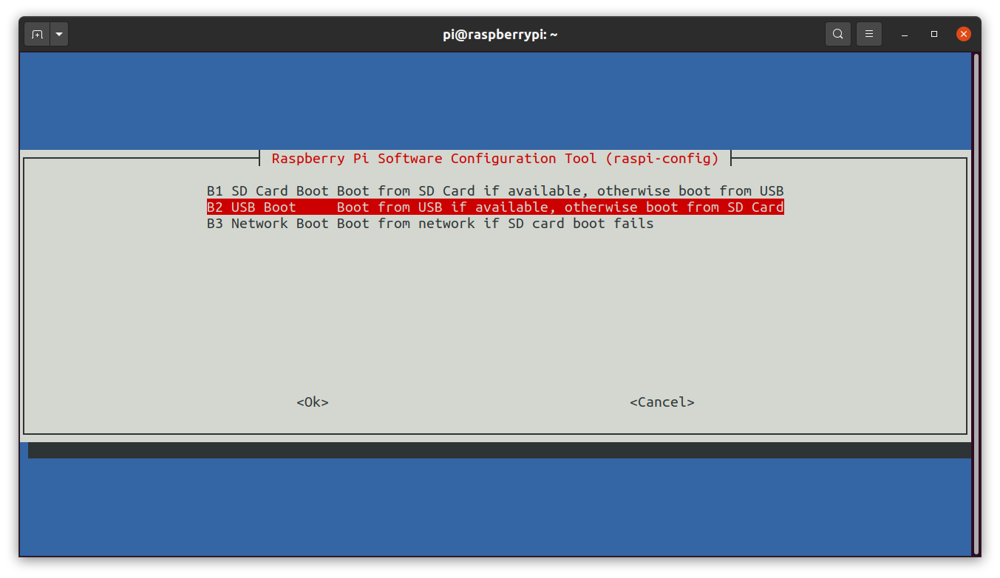
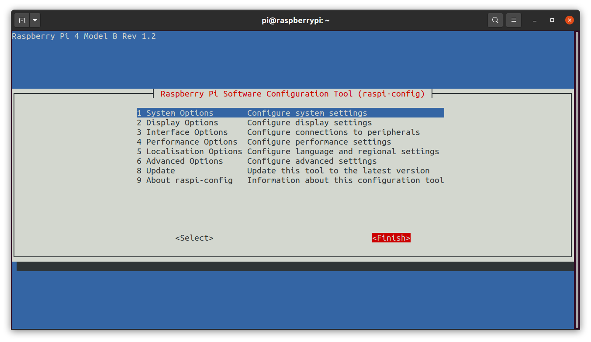
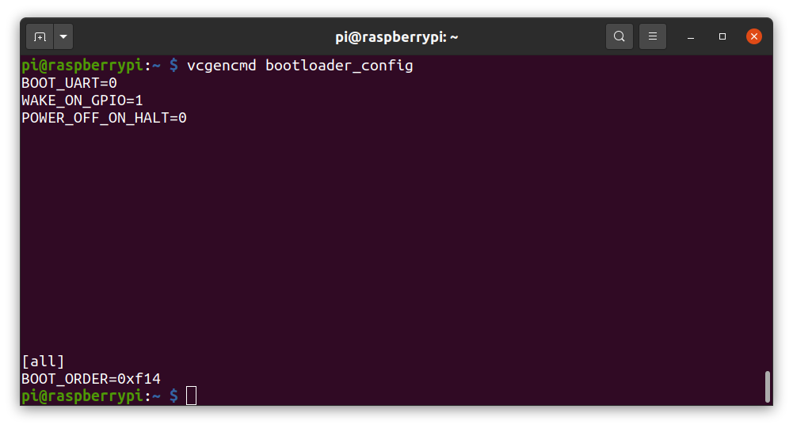

# Boot vanaf SSD


Tijd: 15 minuten


Sinds september 2020 is het officieel mogelijk om je Pi van een SSD op te starten in plaats van de microSD. Opstarten op deze manier geeft [betere performance](https://www.tomshardware.com/news/raspberry-pi-4-ssd-test,39811.html). Daarnaast omzeil je hiermee het gedoe van het mounten en tegen ieder stukje software zeggen dat die van de SSD gebruik moet maken. Aangezien we de SSD toch al hebben, waarom zouden we het dan niet doen?

Steek de microSD en netwerkkabel in de Pi waarna je de stroom aansluit. Na ongeveer een minuutje zal de Pi opgestart zijn en een IP-adres krijgen van je router. Log in op je router, want dit IP-adres heb je nodig. De meeste routers kun je in door naar 192.168.1.1 te gaan in je browser, maar hoe jouw netwerk is ingericht weet je zelf het best.

## SSH

[Secure Shell](https://nl.wikipedia.org/wiki/Secure_Shell) is een protocol om op een versleutelde manier in te loggen op een andere computer en op afstand commando's op de andere computer uit te voeren via een terminal. Middels dit protocol is het mogelijk om vanaf onze computer de Pi aan te sturen.

Open een terminal en typ:

```bash
ssh pi@IP-ADRES VAN PI
```

Vervang in het commando `IP-ADRES VAN PI` met iets als `192.168.1.6`. Zodra je op enter drukt zal je een vraag krijgen waar je `YES/NO` op kunt antwoorden. Typ `yes` en druk op enter. Je krijgt nu de opdracht een wachtwoord in te voeren. **Het standaard wachtwoord is `raspberry`.**

Wat hebben we nu net gedaan? Je hebt met het commando aangegeven dat je van SSH gebruik wil maken. Vervolgens specificeer je een gebruikersnaam en een computer. De computer is bereikbaar via een IP-adres.

## Update

Voer de volgende commando's uit:

```bash
sudo apt update
```

```bash
sudo apt full-upgrade -y
```

```bash
sudo rpi-update
```

```bash
sudo reboot now
```

Je Pi zal nu opnieuw opstarten waarna je opnieuw erin moet SSH'en.

## Boot configuratie

De Pi start standaard op vanaf de microSD. De Pi moet anders geconfigureerd worden om op te starten vanaf de SSD. Eerst moet de Pi voorzien worden van de nieuwste firmware. Voer onderstaande commando uit:

```bash
sudo rpi-eeprom-update -a
```


Als het goed is staat er dat de `BOOTLOADER` up-to-date is en zijn de waardes achter `CURRENT` en `LATEST` gelijk aan elkaar. Mocht je de Pi nog moeten updaten omdat hij niet up-to-date is of omdat `CURRENT` en `LATEST` niet aan elkaar gelijk zijn, herstart dan weer met `sudo reboot now`.

Dan is het nu tijd om de Pi op zo'n manier te configureren dat we kunnen opstarten van de SSD. Voer het volgende uit:

```bash
sudo raspi-config
```

Er toont zich een scherm waardoor het lijkt alsof je in de jaren '80 beland bent. Kies `6 Advanced Options`.


Kies `A7 Bootloader Version`.



Kies `E1 Latest`.



Kies `No` en druk op `Ok`.


Kies nog een keer voor `6 Advanced Options`, maar ga dit maal voor `A6 Boot Order`.



Kies `USB Boot` en druk op `Ok`.



Kies voor `Finish` om de instellingen af te ronden.



En tot slot `Yes` om opnieuw op te starten.


## Dubbelcheck

Om te controleren of alles goed is gegaan moet je weer de Pi in SSH'en. Voer het volgende uit.

```bash
vcgencmd bootloader_config
```

Op de onderste regel moet iets staan als **BOOT\_ORDER=0xf14** (het getal kan ook anders zijn, zoals 0xf41). Als er **BOOT\_ORDER=0x0** staat, heb je iets fout gedaan.



Sluit de SSD aan. Voer `lsblk` uit om de opslag wat je Pi te zien. Als het goed is zie je het onderstaande scherm verschijnen, of iets dat er heel erg op lijkt. De SSD zal ongeveer `mmcblk0` heten en in dit voorbeeld is `sda` de SSD.


We gaan de partities van de SSD "mounten" op de Pi. Doe dat met de volgende vier commando's:

```bash
sudo mkdir /mnt/boot
sudo mkdir /mnt/writable

sudo mount /dev/sda1 /mnt/boot
sudo mount /dev/sda2 /mnt/writable
```

Als je `lsblk` nog een keer uitvoert zie je een scherm zoals hieronder. Je ziet dat de twee partities van je SSD een plekje hebben gekregen in je Pi (onder het kopje MOUNTPOINT).


Zodra dat er goed uit ziet, moet je een script draaien op de Pi. Het script wordt binnengehaald met Git, een versiebeheersysteem dat veel gebruikt wordt in deze gids.

```bash
sudo apt install git -y
```

Na de installatie van Git wordt het script opgehaald en uitgevoerd.

```bash
sudo curl https://raw.githubusercontent.com/TheRemote/Ubuntu-Server-raspi4-unofficial/master/BootFix.sh | sudo bash
```

Zodra je een scherm ziet waarin staat dat het gelukt is, kun je de Pi afsluiten met `sudo shutdown now`.


## Booten

Nu we de bootloader correct hebben ingesteld, kunnen we van de SSD booten. Haal de microSD uit de Pi en sluit de SSD aan. Zet de stroom erop et voilà! Je moet nu je Pin in SSH'en met een andere username en wachtwoord. Doe dat als volgt.

```bash
ssh ubuntu@IP-ADRES VAN PI
```

**Het standaard wachtwoord is `raspberry`.**

Het zou voor kunnen komen dat je de volgende foutmelding krijgt zodra opnieuw probeert te SSH'en naar je Pi:

```bash
@@@@@@@@@@@@@@@@@@@@@@@@@@@@@@@@@@@@@@@@@@@@@@@@@@@@@@@@@@@
@    WARNING: REMOTE HOST IDENTIFICATION HAS CHANGED!     @
@@@@@@@@@@@@@@@@@@@@@@@@@@@@@@@@@@@@@@@@@@@@@@@@@@@@@@@@@@@
IT IS POSSIBLE THAT SOMEONE IS DOING SOMETHING NASTY!
Someone could be eavesdropping on you right now (man-in-the-middle attack)!
(...)
```

Zoiets is gemakkelijk op te lossen door op je computer het commando `nano .ssh/known_hosts` in te voeren. In het scherm dat volgt staan bekende computers voor jouw computer. Verwijder de regel met het IP-adres van jouw Pi. Sla het bestand op met `Ctrl + X` en bevestig met `Y`. Je hebt nu tegen jouw computer gezegd dat hij de eerdere relatie met de Pi mag vergeten en een nieuwe relatie mag opbouwen.

De eerste keer vraagt Ubuntu om het instellen van een nieuw wachtwoord. Kies een sterk wachtwoord en onthoud deze goed. Het is het wachtwoord voor de gebruiker `ubuntu` en deze gebruiker beheert later alles in de gids.

